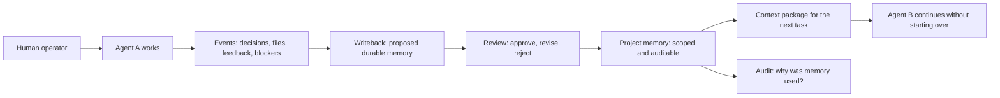

# iHow Memory

### An open standard for durable, auditable memory across AI agents

[中文](./README.zh-CN.md) · [Whitepaper](./whitepaper/whitepaper-public-v0.1.en.md) · [Protocol](./spec/protocol-draft-v0.1.md) · [Scenarios](./scenarios/reliability-scenarios-v0.1.md) · [Diagrams](./docs/diagrams.md)

AI agents are powerful inside one chat. Real work is longer than one chat.

iHow Memory defines a local-first memory and handoff reliability layer so agents, tools, and human operators can share durable project context across sessions, models, and handoffs without relying on hidden chat history.

> v0.1 is an open-standard draft. It intentionally publishes specifications, scenarios, diagrams, and documentation only. No implementation code is included.

## The Problem in One Picture

## Why This Matters

Most AI work fails at the handoff boundary:

| Failure | What happens |
|---|---|
| Revision amnesia | The same feedback is repeated again and again. |
| Tool-swap amnesia | Moving from one AI tool to another loses project state. |
| Handoff amnesia | A new person or agent must reread raw history before becoming useful. |
| Safety drift | Hard constraints become ordinary suggestions and get ignored. |

iHow Memory treats memory as shared project infrastructure, not a private feature inside one agent.

## What Makes It Different

- Local-first by default: project memory stays in the operator's chosen environment.
- Human-readable: durable state is inspectable and reviewable.
- Model-neutral: memory semantics are not tied to one LLM provider.
- Multi-agent native: handoff is a first-class reliability target.
- Auditable: memory has provenance, scope, review status, and lifecycle records.
- Conformance-oriented: quality is measured by behavior, not by storage technology.

## v0.1 Published Materials

| Area | File |
|---|---|
| Non-technical overview | [`docs/overview-for-non-technical-readers.md`](./docs/overview-for-non-technical-readers.md) |
| Diagrams | [`docs/diagrams.md`](./docs/diagrams.md) |
| Whitepaper | [`whitepaper/whitepaper-public-v0.1.en.md`](./whitepaper/whitepaper-public-v0.1.en.md) |
| Chinese whitepaper | [`whitepaper/whitepaper-public-v0.1.zh-CN.md`](./whitepaper/whitepaper-public-v0.1.zh-CN.md) |
| Protocol draft | [`spec/protocol-draft-v0.1.md`](./spec/protocol-draft-v0.1.md) |
| Reliability scenarios | [`scenarios/reliability-scenarios-v0.1.md`](./scenarios/reliability-scenarios-v0.1.md) |
| Conformance direction | [`conformance/README.md`](./conformance/README.md) |
| Release scope | [`docs/release-scope-v0.1.md`](./docs/release-scope-v0.1.md) |
| Security boundary | [`docs/security-boundary.md`](./docs/security-boundary.md) |

## Reliability Scenarios

The v0.1 scenario set defines five acceptance-style tests:

1. Cross-Tool Handoff / 跨工具接力
2. Feedback Pattern Capture / 反馈规律沉淀
3. Constraint Preservation / 禁忌约束执行
4. Human Team Handoff / 新人接手
5. Model Migration / 跨模型迁移

Each scenario includes Given, When, Then, failure modes, and acceptance criteria.

## Protocol Draft

The protocol draft defines four core interfaces:

- `events`: workflow event ingestion
- `context`: bounded context package retrieval
- `writeback`: proposed durable memory and review
- `audit`: traceability and lifecycle control

It also defines isolation boundaries for tenant, customer, project, and user scopes.

## Validation Direction

iHow Memory has been evaluated internally against long-term memory and handoff reliability tasks, including LongMemEval-style retrieval checks and multi-agent handoff workflows. The public v0.1 repository publishes the reliability language first; future versions may add executable conformance tooling after the standard boundary is stable.

## What Is Not Included in v0.1

This repository intentionally does not include:

- tool integration code
- SDKs
- runtime services
- hosted service code
- deployment recipes
- private operations
- customer-specific materials
- generated benchmark data

The first public release is deliberately narrow: define the standard before publishing implementation details.

## License

- Specification and scenario materials are licensed under CC BY 4.0. See [`LICENSE-SPEC`](./LICENSE-SPEC).
- Whitepaper and documentation materials are licensed under CC BY 4.0. See [`LICENSE-DOCS`](./LICENSE-DOCS).
- The iHow Memory name and marks are not licensed for unrestricted brand use. See [`TRADEMARK`](./TRADEMARK).

Future code releases, if any, may use a separate software license. No software license is granted by this v0.1 repository.

## Status

v0.1 draft for review.
