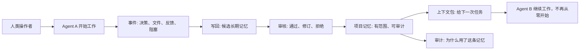

# iHow Memory

### 面向 AI Agent 的持久、可审计、可交接记忆开放标准

[English](./README.md) · [白皮书](./whitepaper/whitepaper-public-v0.1.zh-CN.md) · [协议草案](./spec/protocol-draft-v0.1.md) · [可靠性场景](./scenarios/reliability-scenarios-v0.1.md) · [机制图](./docs/diagrams.zh-CN.md)

AI Agent 在单次对话里已经足够聪明，但真实工作往往跨会话、跨工具、跨模型、跨人接手。

iHow Memory 定义一套本地优先的记忆与交接可靠性层，让不同 agent、工具和人可以共享持久、可限定、可审计的项目上下文，而不是每次都依赖某个聊天窗口里的隐藏历史。

> v0.1 是开放标准草案，不是代码发布。本仓库只发布规格、场景、图解和文档，不包含实现代码。

## 一张图看懂问题

## 为什么重要

多数 AI 工作流不是失败在模型能力，而是失败在交接边界：

| 失忆类型 | 真实后果 |
|---|---|
| 改稿失忆 | 同一个反馈要重复说很多次。 |
| 换工具失忆 | 从一个 AI 工具切到另一个工具，项目状态丢失。 |
| 接手失忆 | 新人或新 agent 必须翻完整历史，才能继续做事。 |
| 安全漂移 | 硬约束被当成普通建议，最后被忽略。 |

iHow Memory 把记忆看成共享的项目基础设施，而不是某个 agent 的私有功能。

## 它和普通记忆有什么不同

- 本地优先：项目记忆默认留在操作者选择的环境里。
- 人可读：持久状态可以检查、修改、回滚。
- 模型无关：记忆语义不绑定某个 LLM 厂商。
- 多 agent 原生：交接是第一等可靠性目标。
- 可审计：记忆有来源、范围、审核状态和生命周期记录。
- 以一致性为核心：用行为验收标准衡量质量，而不是限定存储技术。

## v0.1 发布内容

| 内容 | 文件 |
|---|---|
| 非技术读者概览 | [`docs/overview-for-non-technical-readers.zh-CN.md`](./docs/overview-for-non-technical-readers.zh-CN.md) |
| 机制图 | [`docs/diagrams.zh-CN.md`](./docs/diagrams.zh-CN.md) |
| 中文白皮书 | [`whitepaper/whitepaper-public-v0.1.zh-CN.md`](./whitepaper/whitepaper-public-v0.1.zh-CN.md) |
| 英文白皮书 | [`whitepaper/whitepaper-public-v0.1.en.md`](./whitepaper/whitepaper-public-v0.1.en.md) |
| 协议草案 | [`spec/protocol-draft-v0.1.md`](./spec/protocol-draft-v0.1.md) |
| 可靠性场景 | [`scenarios/reliability-scenarios-v0.1.md`](./scenarios/reliability-scenarios-v0.1.md) |
| 一致性测试方向 | [`conformance/README.zh-CN.md`](./conformance/README.zh-CN.md) |
| 发布范围 | [`docs/release-scope-v0.1.zh-CN.md`](./docs/release-scope-v0.1.zh-CN.md) |
| 安全边界 | [`docs/security-boundary.zh-CN.md`](./docs/security-boundary.zh-CN.md) |

## 五个可靠性场景

v0.1 定义了五个验收式场景：

1. Cross-Tool Handoff / 跨工具接力
2. Feedback Pattern Capture / 反馈规律沉淀
3. Constraint Preservation / 禁忌约束执行
4. Human Team Handoff / 新人接手
5. Model Migration / 跨模型迁移

每个场景都包含 Given、When、Then、失败模式和验收标准。

## 四个核心接口

协议草案定义四个核心接口：

- `events`：工作流事件写入
- `context`：最小上下文包读取
- `writeback`：候选长期记忆写回与审核
- `audit`：记忆来源、使用和生命周期追溯

同时定义 tenant、customer、project、user 四层隔离边界。

## v0.1 不包含什么

本仓库刻意不包含：

- 工具接入代码
- SDK
- 运行时服务
- 托管服务代码
- 部署配方
- 私有运维流程
- 客户特定材料
- 生成型 benchmark 数据

第一版公开发布的重点是先定义标准语言，再决定何时公开实现细节。

## License

- 规格与场景材料使用 CC BY 4.0。见 [`LICENSE-SPEC`](./LICENSE-SPEC)。
- 白皮书与文档材料使用 CC BY 4.0。见 [`LICENSE-DOCS`](./LICENSE-DOCS)。
- iHow Memory 名称与标识不授予无限制品牌使用权。见 [`TRADEMARK`](./TRADEMARK)。

未来如果发布代码，可以单独使用软件许可证。v0.1 仓库不授予软件许可证。

## 状态

v0.1 draft for review。
