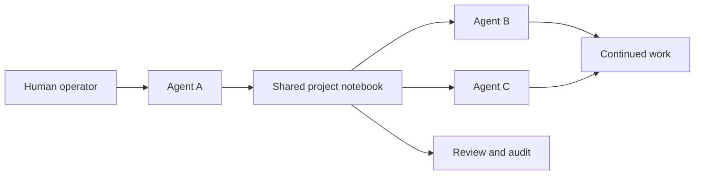
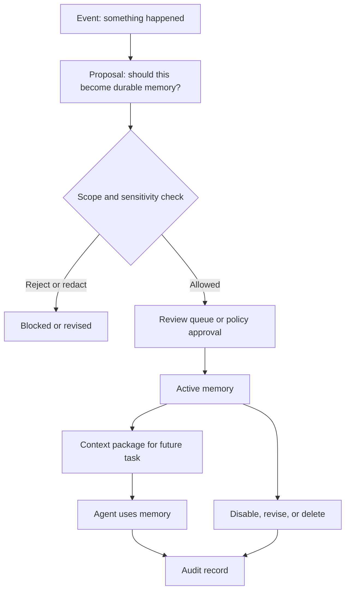
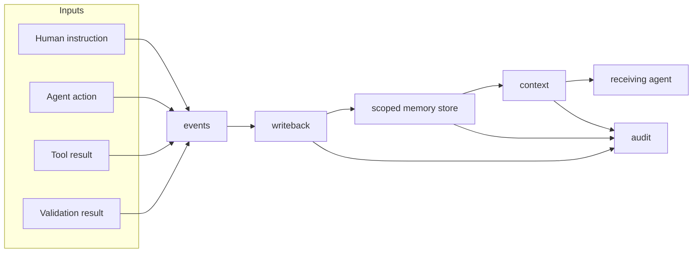
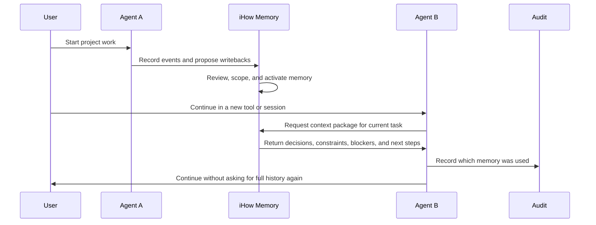
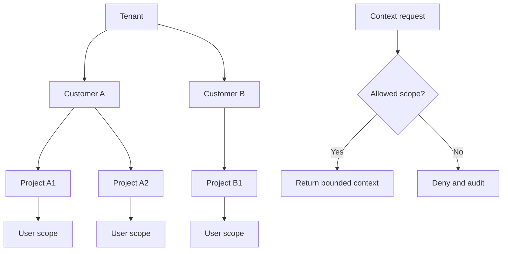
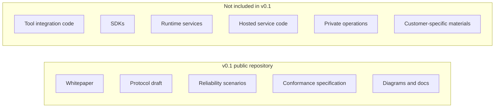

# iHow Memory Diagrams

These diagrams explain the v0.1 mechanism at different levels of detail.

## 1. Non-Technical Overview

The simplest view: iHow Memory is a shared, reviewed project notebook for multiple AI agents.

## 2. Memory Lifecycle

This is the core mechanism: raw work is not automatically trusted. Important facts become proposed memory, then pass through scope, sensitivity, and review controls.

## 3. Four Core Interfaces

The protocol is intentionally small: record events, propose durable memory, retrieve bounded context, and audit lifecycle and usage.

## 4. Multi-Agent Handoff

The handoff target is explicit: the next agent should receive the smallest useful context package, not the entire raw history.

## 5. Namespace Isolation

Memory retrieval should respect tenant, customer, project, and user boundaries before returning context.

## 6. v0.1 Public Boundary

The public draft defines the reliability language first. Implementation details can be considered later, under a separate release and license decision.
