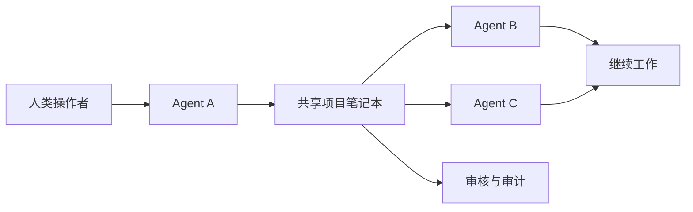
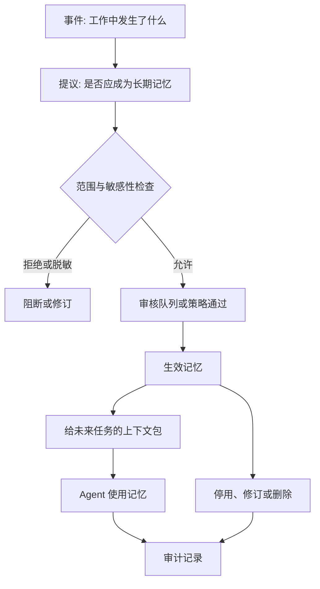
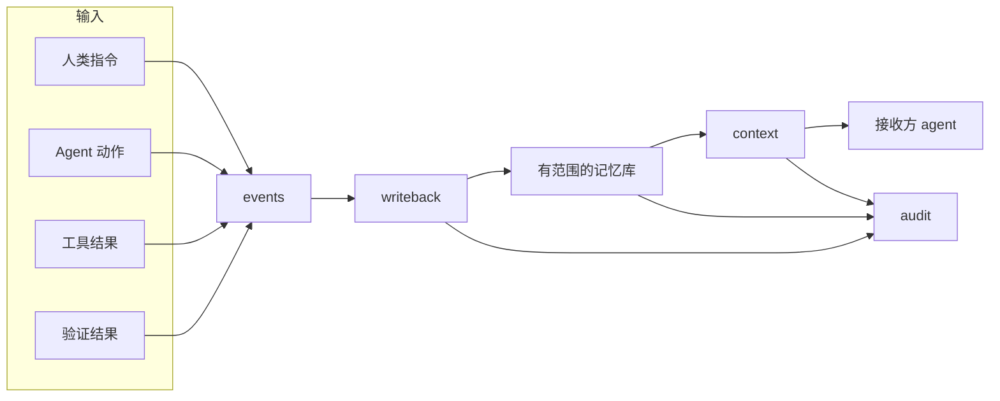
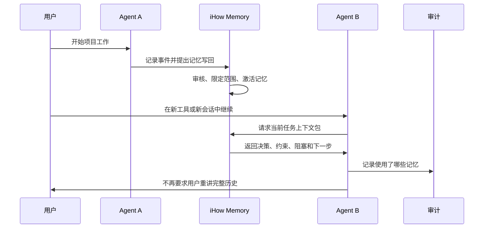
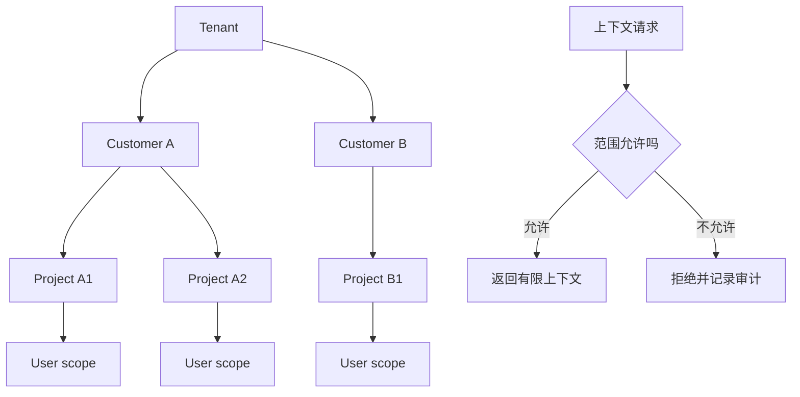
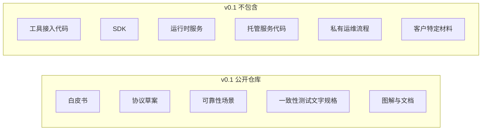

# iHow Memory 机制图

这些图从不同层次解释 v0.1 的机制。

## 1. 非技术总览

最简单的理解：iHow Memory 是给多个 AI Agent 共用的、经过审核的项目笔记本。

## 2. 记忆生命周期

核心机制是：原始工作不会自动变成可信记忆。重要事实先成为候选记忆，再经过范围、敏感性和审核控制。

## 3. 四个核心接口

协议刻意保持很小：记录事件、提出长期记忆、读取有限上下文、审计生命周期和使用过程。

## 4. 多 Agent 接力

接力目标很明确：下一个 agent 应该拿到小而准的上下文包，而不是完整原始历史。

## 5. 命名空间隔离

记忆读取必须先尊重 tenant、customer、project、user 四层边界，再返回上下文。

## 6. v0.1 公开边界

公开草案先定义可靠性语言。实现细节可以在未来版本中单独讨论，并使用单独的发布和许可证决策。
