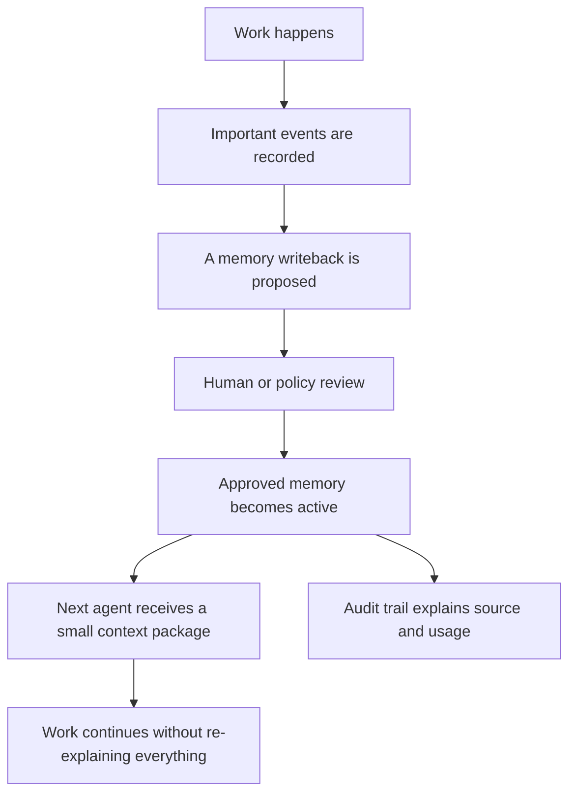

# iHow Memory for Non-Technical Readers

## The Short Version

iHow Memory is a shared project notebook for AI agents.

It helps different AI tools remember what has already been decided, what the user dislikes, which constraints are strict, what is still blocked, and what the next agent should do.

The goal is simple: when work moves from one chat, tool, model, or person to another, the new agent should not start from zero.

## The Everyday Analogy

Imagine a project team where every assistant has short-term memory but no shared notebook.

One assistant edits a document. Another assistant joins tomorrow. A third assistant reviews the final version next week. Without a shared notebook, each assistant asks the same questions again:

- What did we already decide?
- What did the user reject before?
- Which style rules are hard constraints?
- Which files changed?
- What is still blocked?
- Why was this decision made?

iHow Memory is the shared notebook plus the review log. It keeps the important project facts in a scoped, auditable form.

## What It Stores

iHow Memory is not trying to store everything.

It focuses on durable project memory:

- decisions
- constraints
- recurring feedback patterns
- handoff notes
- blockers
- validation results
- source references
- audit records

It should not store secrets, credentials, unrelated private conversations, or uncontrolled raw history.

## How It Works

## Why It Is Not Just Chat History

Chat history is raw, long, private to one tool, and hard to audit.

iHow Memory turns important project state into durable memory with scope, source, review status, and lifecycle controls.

## Why It Is Not Just a Vector Database

A vector database can retrieve similar text. That is useful, but similarity is not the same as reliability.

iHow Memory asks reliability questions:

- Was this memory reviewed?
- Is it a hard constraint or a soft preference?
- Which project does it belong to?
- Who or what created it?
- Why was it retrieved for this task?
- Can it be revised, disabled, deleted, or audited?

## What v0.1 Publishes

v0.1 publishes the reliability language first:

- the problem definition
- the protocol draft
- five reliability scenarios
- conformance direction
- diagrams and non-technical explanations
- security and namespace boundaries

It does not publish implementation code.

## The Promise

AI work should be continuous.

The user should not have to rebuild project context every time the tool, model, chat window, or teammate changes.
