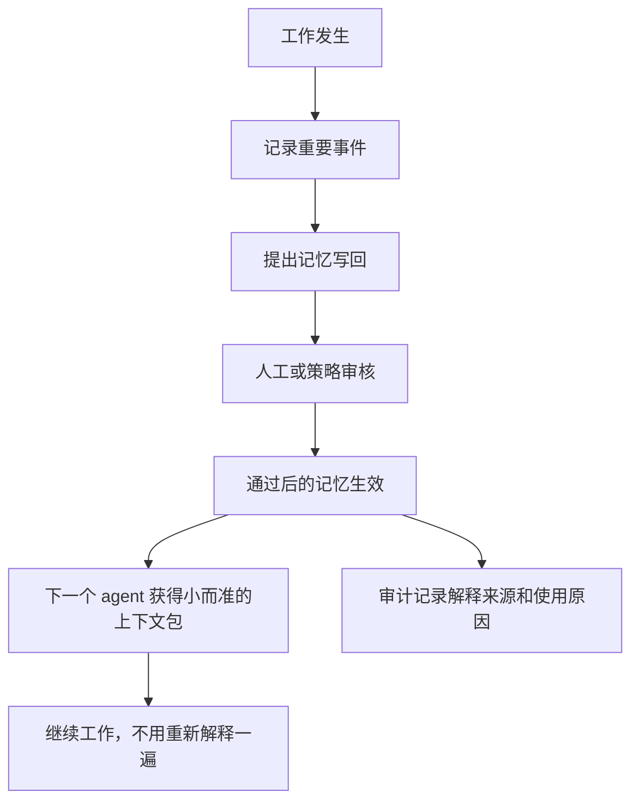

# 给非技术读者看的 iHow Memory

## 一句话版本

iHow Memory 是给 AI Agent 用的共享项目笔记本。

它帮助不同 AI 工具记住：已经决定了什么、用户不喜欢什么、哪些约束绝对不能违反、当前卡在哪里、下一个 agent 应该接着做什么。

目标很简单：当工作从一个聊天窗口、一个工具、一个模型或一个人切到另一个时，新接手的一方不要从零开始。

## 日常类比

想象一个项目团队，每个助手都很聪明，但大家没有共享项目笔记。

一个助手今天改文档，另一个助手明天接手，第三个助手下周做最终审稿。如果没有共享笔记，每个人都会重复问：

- 我们之前决定过什么？
- 用户之前否定过什么？
- 哪些风格规则是硬约束？
- 哪些文件改过？
- 现在还有什么阻塞？
- 当时为什么做这个决定？

iHow Memory 就是共享笔记本，加上一份可追溯的审核记录。它把重要项目事实沉淀成有范围、可审计的记忆。

## 它记什么

iHow Memory 不是要保存所有东西。

它关注的是长期有用的项目记忆：

- 决策
- 约束
- 反复出现的反馈规律
- 交接摘要
- 阻塞点
- 验证结果
- 来源引用
- 审计记录

它不应该保存密码、凭证、无关私聊、不可控的原始历史。

## 它怎么工作

## 它为什么不是聊天记录

聊天记录是原始、冗长、绑定某个工具、很难审计的。

iHow Memory 会把重要项目状态变成带有范围、来源、审核状态和生命周期控制的持久记忆。

## 它为什么不是普通向量数据库

向量数据库可以找相似文本，这很有用，但“相似”不等于“可靠”。

iHow Memory 关心的是可靠性问题：

- 这条记忆审核过吗？
- 它是硬约束，还是软偏好？
- 它属于哪个项目？
- 谁创建了它？
- 为什么这次任务要读取它？
- 它能不能被修订、停用、删除、审计？

## v0.1 公开什么

v0.1 先公开标准语言：

- 问题定义
- 协议草案
- 五个可靠性场景
- 一致性测试方向
- 图解和非技术说明
- 安全与命名空间边界

它不公开实现代码。

## 最终承诺

AI 工作应该是连续的。

用户不应该因为换工具、换模型、换聊天窗口或换人接手，就反复重建同一份项目上下文。
